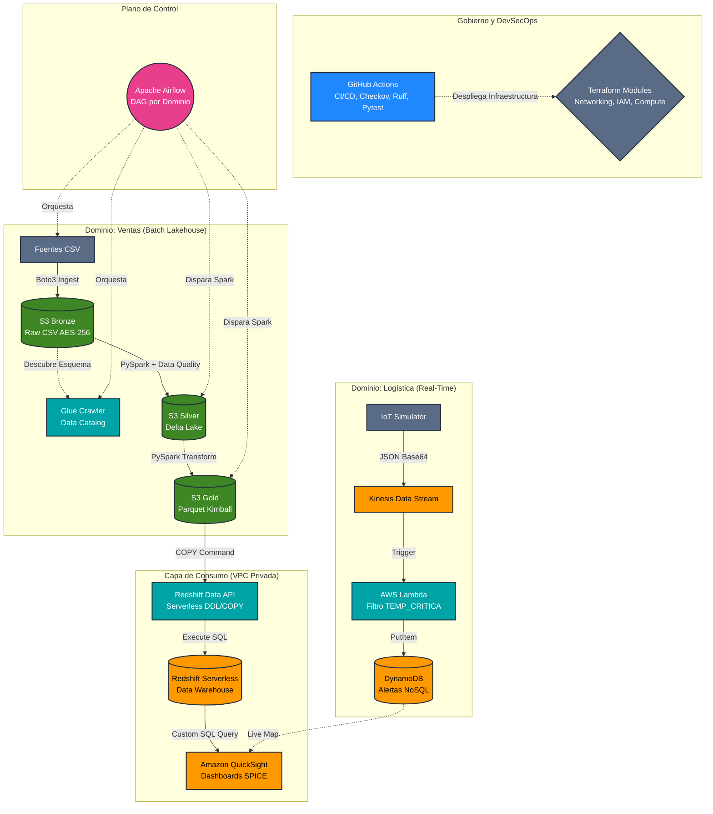

# 🏛️  Arquitectura Corporativa - LogiData S.A.S.

## Topología de la Arquitectura (Data Mesh & Lakehouse)

El sistema implementa una **Arquitectura Lambda Híbrida** bajo el paradigma de **Data Mesh** (Malla de Datos). Las responsabilidades, el código y los pipelines están descentralizados por dominios de negocio (*Sales* y *Logistics*), gobernados por un orquestador central y desplegados mediante Infraestructura como Código modular.

### Componentes Clave de la Arquitectura:
*   **Aislamiento de Red:** Redshift Serverless y PostgreSQL operan en subredes privadas (`publicly_accessible = false`). La interacción se realiza mediante la **API de Datos de Redshift**, eliminando la necesidad de exponer puertos en internet.
*   **Lakehouse Híbrido:** La capa *Silver* utiliza **Delta Lake** para garantizar transacciones ACID y evolución de esquemas (Time Travel). La capa *Gold* se materializa en **Parquet plano** para maximizar el rendimiento del comando `COPY` nativo de Redshift.
*   **Circuit Breakers (Data Quality):** Antes de mutar los datos en el Data Lake, PySpark ejecuta validaciones de integridad referencial y de negocio. Si fallan, Airflow aborta el pipeline, protegiendo el Data Warehouse.

