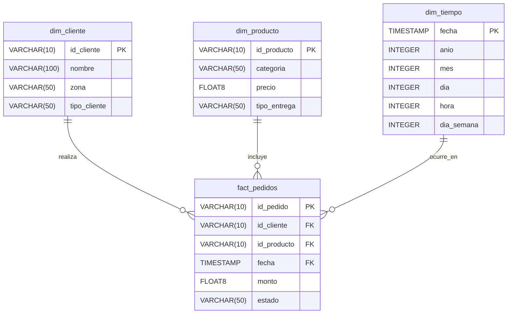

# 🏛️  Modelo de Datos - LogiData S.A.S.
## Modelo de Datos

Al aplicar un enfoque de Data Mesh, el modelo de datos se divide en "Productos de Datos" según el dominio que los produce.

### A. Producto de Datos: Ventas (Modelo Analítico - Capa Gold)
Diseñado bajo la metodología de **Ralph Kimball (Esquema en Estrella)**, optimizado para agregaciones (SUM, COUNT) y análisis de series de tiempo en Redshift. Las columnas irrelevantes para Ventas (como el conductor o vehículo de entrega) se delegaron a sus respectivos dominios.

#### Diccionario de Datos (Ventas):
*   **`fact_pedidos`:** Tabla central de hechos. Almacena las métricas transaccionales base (`monto`). Se utilizan tipos `FLOAT8` para garantizar compatibilidad binaria perfecta con los archivos Parquet generados por Spark.
*   **`dim_tiempo`:** Dimensión generada sintéticamente en PySpark para desglosar el timestamp en componentes atómicos (`anio`, `mes`, `dia_semana`), evitando sobrecargar a Redshift con cálculos de fechas en tiempo de consulta.
*   **`dim_cliente` & `dim_producto`:** Dimensiones descriptivas que permiten segmentar las métricas mediante la llave foránea correspondiente.

---

### B. Producto de Datos: Logística / IoT (Modelo NoSQL)
Diseñado para operaciones de escritura masiva (Alta Ingesta) y búsquedas por clave primaria en **Amazon DynamoDB**. Es una base de datos *Schema-less* donde la Lambda inyecta exclusivamente las alertas de la cadena de frío.

| Atributo | Tipo DynamoDB | Descripción |
| :--- | :--- | :--- |
| **`id`** | `String` (Partition Key) | UUID v4 inyectado por Lambda. Garantiza distribución uniforme en las particiones de AWS. |
| **`vehiculo`** | `String` | Placa o identificador del camión (Ej. `V0475`). |
| **`timestamp`** | `String` | Marca de tiempo del sensor GPS/Termómetro. |
| **`temperatura`** | `Number` (Decimal) | Temperatura capturada. Convertida a tipo Decimal estricto para evitar excepciones de `boto3`. |
| **`latitud` / `longitud`**| `Number` (Decimal) | Coordenadas geográficas para mapeo espacial en QuickSight. |

